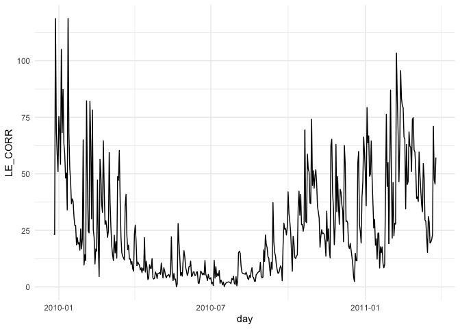

<!-- README.md is generated from README.Rmd. Please edit that file -->

# fluxcleanr

<!-- badges: start -->

<!-- badges: end -->

Countless academic papers use data from the FLUXNET2015 dataset to
calibrate and validate their gross primary production and
evapotranspiration models. Unfortunately, there is no common framework
for aggregating and cleaning these data, meaning methods across papers
may be inconsistent. This can be problematic when comparing results from
two separate papers or models.This package cleans, gap fills and filters
latent heat flux and GPP data from the FLUXNET2015 dataset to provide a
consistent framework for ET and GPP model calibration and validation.

## Installation

You can install fluxcleanr with:

``` r
devtools::install_github("colinbrust/fluxcleanr")
```

## Example

This is a basic example which shows you how to solve a common problem:

``` r
library(fluxcleanr)
library(ggplot2)

# Get path to example flux data.
f <- system.file('extdata',
                 "FLX_AR-SLu_FLUXNET2015_FULLSET_HH_2009-2011_1-4.csv",
                 package='fluxcleanr')

# Remove low quality data and tidy data frame
cleaned <- clean_le(f)

# Gap-fill missing values 
filtered <- filter_le(cleaned, hh= TRUE, avg_daily = TRUE)

# Plot the results.
ggplot(filtered, aes(x=day, y=LE_CORR)) + 
  geom_line() + 
  theme_minimal()
```


